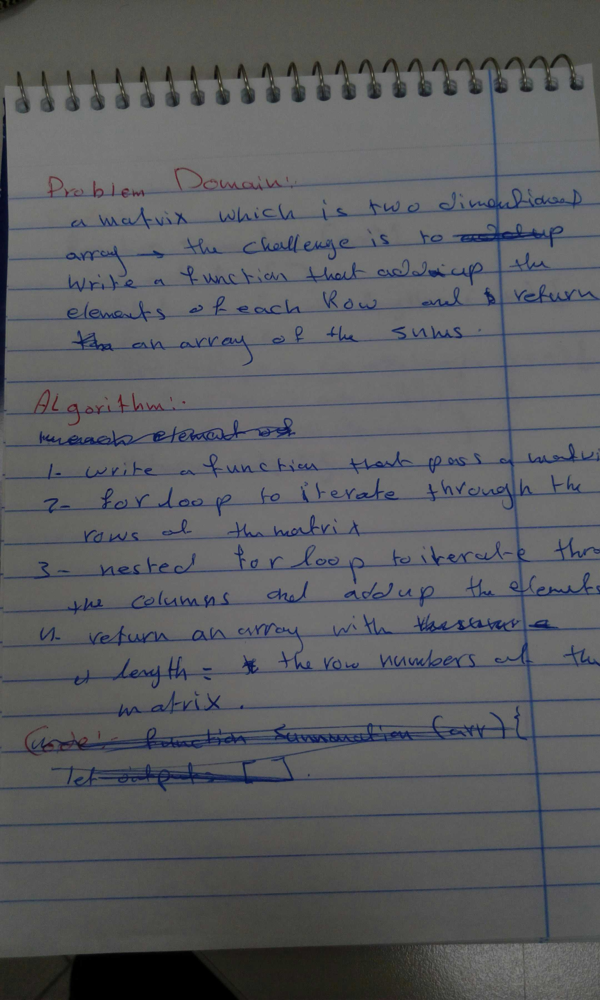
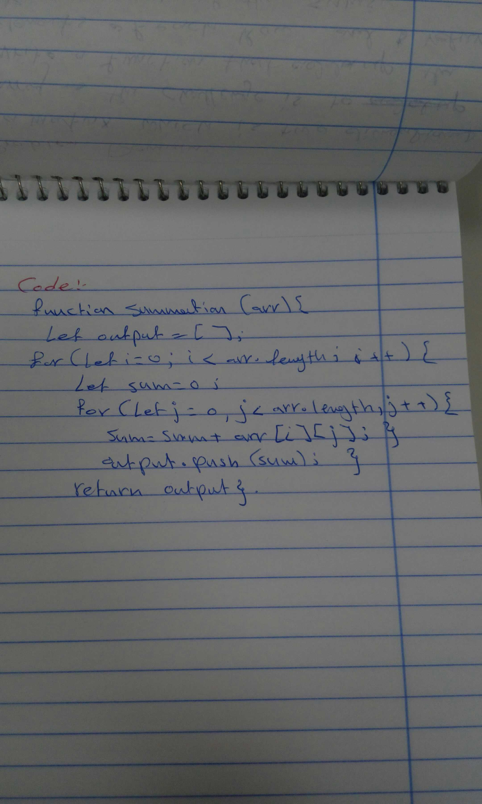

# Code Challeng-04

## Description
In this code challenge I was the candidate and Obadeh was the itreviwer, he asked me to create a function that  add up the sum of each row in a matrix of arbitrary size and return an array of the sums.

## SRC

