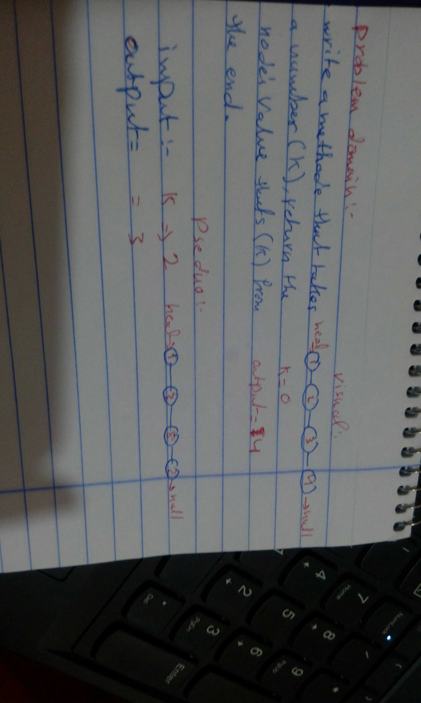

# Challenge Summary
implement a new method on the linked list

## Challenge Description
to Write a method for the Linked List class which takes a number, k, as a parameter. Return the node’s value that is k from the end of the linked list. 

## Approach & Efficiency
writting the method then testing it

## Solution
creat the functions then test them

## Efficiency (Big O)
- **ll.kthFromEnd(k)** : o(n)

## Whiteboard 
