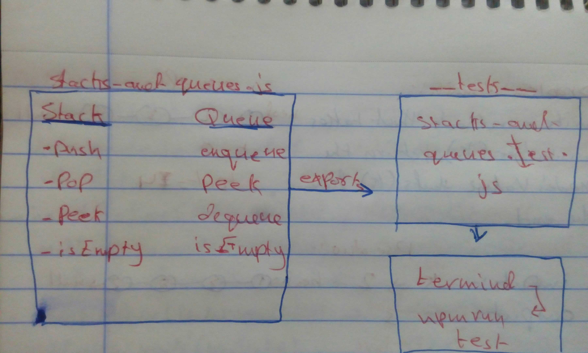

# Code Challenge 10

## Stack and a Queue Implementation

## Challenge Summary
implement methods on the stacks and queues

## Challenge Description
to Write multi methods for the  stacks and queues that add, remove, peek or see if empty

## Approach & Efficiency
writting the methods then testing it

## Solution
creat the functions then test them

## Efficiency (Big O)
- push: Constant — O(1)
- pop: Constant — O(1)
- peek: Constant — O(1)
- empty: Constant — O(1)

## Whiteboard 
